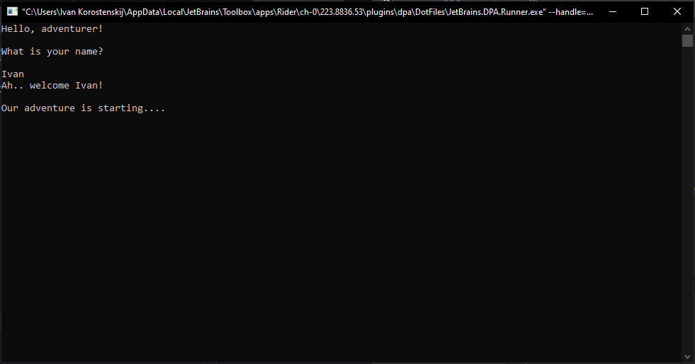

# Forgotten Forest RPG

**Work in progress**

A cutting-edge text adventure built using .NET with natural language processing and state-machine flow. You're sitting near your campfire, surrounded by unfamiliar woods. You begin to question your place and memories, but an internal voice other than yours is set on keeping the facade of normalcy up. Enigma of the Enchanted Forest invites players to explore their role in a mysterious dynamic. and thought-provoking adventure through an engaging command-line story - filled with intrigue, puzzles, and unexpected twists.

## Features

- Written in C# for the .NET Core (7.1) platform 
- Utilizes advanced state-machine logic for the game's narrative flow
- Incorporates nNatural language processing with Microsoft's Cognitive Services for a dynamic user experience
- Interactive storytelling with immersive text descriptions, ever-changing pace, and ASCII art
- Time-based text rendering for enhanced realism

## Current state

The current state features a (not-so) warm, yet immersive welcome to the world of this project. The introduction presents your scenario and establishes the mysterious setting from the very start, without fixed, given choices for any scenario, and a natural-feeling, responsive text and visual prompts that provide dynamic, real-time feedback for the player.



## How do I play?

1. Clone the repository:
```bash
git clone https://github.com/ivankoros/forgotten-forest
```
2. Open the project in Visual Studio or another C# IDE (I use Jetbrains' Rider)

3. Build and run the project

Enjoy the adventure, and stay tuned for updates as we expand the world and story!

## Contributing

We welcome contributions to this project. Please read the [CONTRIBUTING.md](CONTRIBUTING.md) for more information on how to contribute.

## License

This project is licensed under the MIT License. See the [LICENSE.md](LICENSE) file for details.
